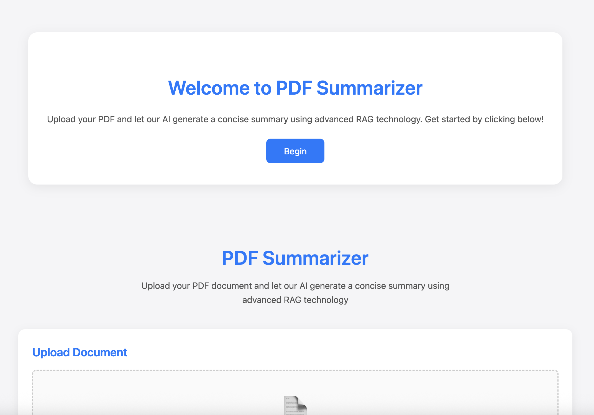
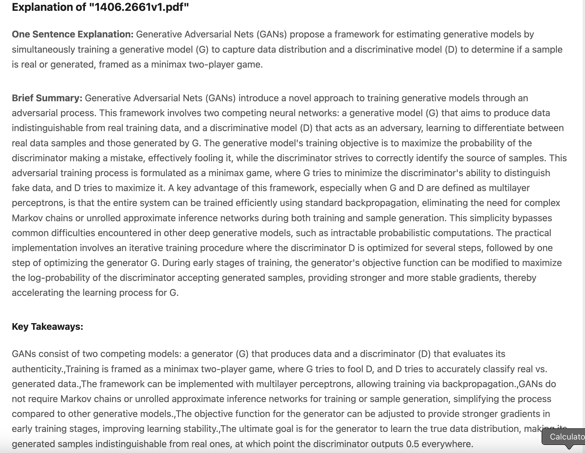
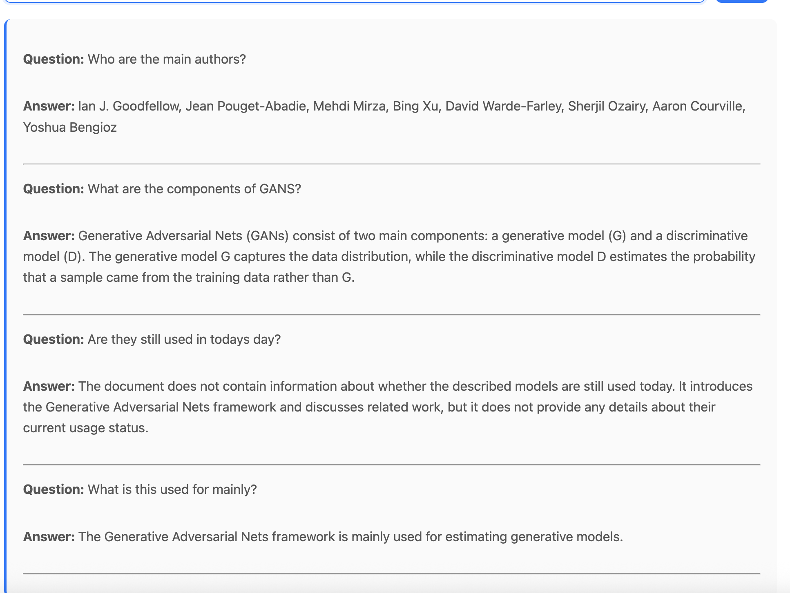

# Note Helper 🤖📝

**Note Helper** is an interactive, AI-powered study assistant designed to help students learn more effectively. By leveraging Google's Gemini API, it transforms documents into learning resources. Upload your notes or textbook chapters, and instantly receive summaries, key takeaways, and a powerful Q&A interface grounded in your provided material.


## ✨ Features

*   **Smart Document Analysis:** Automatically generates a one-sentence summary, a brief overview, and key takeaways upon upload.
*   **Interactive Q&A:** Ask any question related to your uploaded document and get precise answers using Retrieval-Augmented Generation (RAG).
*   **Clean & Simple Interface:** A user-friendly web app built with vanilla HTML, CSS, and JavaScript for easy access.
*   **Context-Aware:** Maintains the context of your document for the entire session, enabling deep and relevant exploration of the topic.

## 🛠️ How It Works (In Depth)

Note Helper is a classic example of a **Retrieval-Augmented Generation (RAG)** system, tailored for personal education.

1.  **Frontend (Client):** The interface where users upload documents and type their questions. It communicates with the backend via API calls.
2.  **Backend (Server):** The engine of the application. It handles the document processing and interactions with the AI model.
3.  **Document Processing:**
    *   Upon upload, the document text is extracted and sent to the backend.
    *   The backend uses carefully engineered prompts with the Gemini API to perform an initial analysis, creating a structured JSON summary.
    *   This summary is sent back to the frontend for display, and the full document text is stored in memory for the session.
4.  **Question Answering (RAG):**
    *   When a user asks a question, it is sent to the backend along with the context from the stored document.
    *   The backend constructs a prompt for Gemini that includes the user's question and the relevant document text, forcing the AI to "reason" from your notes.
    *   This ensures answers are specific, accurate, and directly based on the provided material, avoiding generic or incorrect responses.

## 🚀 Demo

| Welcome Page | Document Summary | Interactive Q&A |
| :---: | :---: | :---: |
|  |  |  |

## 📦 Installation & Local Setup

To run this project locally, you'll need to provide your own Google Gemini API key.

1.  **Clone the repository:**
    ```bash
    git clone https://github.com/vishnucanada/note-helper.git
    cd note-helper
    ```

2.  **Set up your environment variables:**
    Create a `.env` file in the `backend` directory and add your API key:
    ```env
    GEMINI_API_KEY=your_google_gemini_api_key_here
    ```

4.  **Start the backend server:**
    ```python
    python3 endpoint.py or python endpoint.py
    ```

5.  **Serve the frontend:**
    Open the `frontend` directory and use a local server.
    
    Alternatively, you can open `index.html` directly in your browser, but note that some features may not work correctly due to CORS.

6.  **Open your browser:**
    Navigate to `http://localhost:5000` (or the port you specified).

## 🔮 Future Roadmap & Contributing

The project is under active development. Contributions and ideas are welcome!

**Planned Enhancements:**
-   **Deployment:** Host the application to make it publicly accessible without local setup.
-   **Performance:** Investigate alternative LLMs or optimization techniques to reduce response latency.
-   **Export Features:** Generate downloadable study aids like flashcards, condensed notes, or PowerPoint presentations.
-   **Self-Testing:** Implement a feature where the AI generates quiz questions based on the document to test the user's understanding.
-   **Session Persistence:** Move from in-memory storage to a proper database to save documents and conversations across sessions.

Please feel free to fork this repository, open issues for bugs or suggestions, and submit pull requests.

